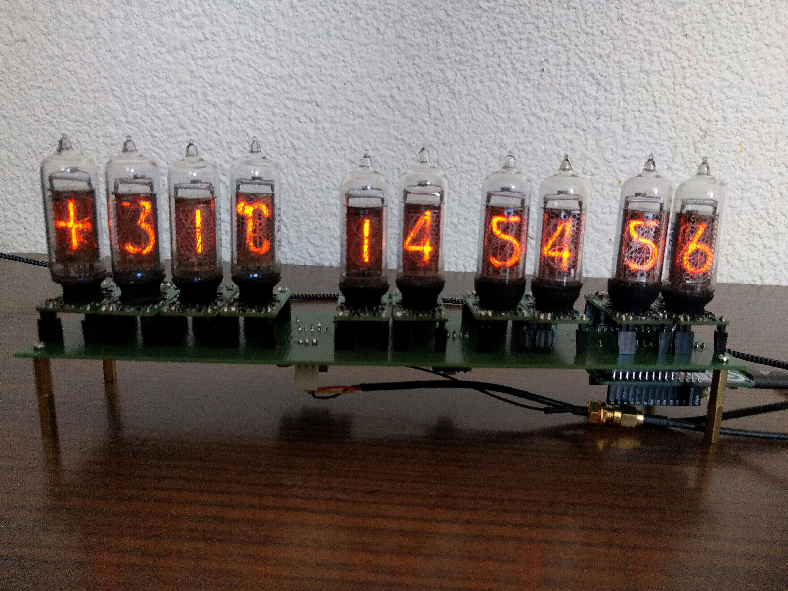

# nixie-temp-clock
A modular nixie clock and thermometer based on [Exixe](https://github.com/dekuNukem/exixe).

## Features
- Shows temperature (in °C) and GPS-synchronized time
- Completely modular: the PCB only connects all modules via pin headers

## Hardware
To build your own you need:
- The PCB
- Ten Exixe modules
- One IN-19A, one IN-19V and eight IN-14 tubes
- A high-voltage power supply, as the nixies need 180V to glow. Has to be pin-compatible to [this one](https://www.ebay.com/itm/322511957768)
- A DS18B20 temperature sensor
- A GPS module which communicates via I²C, I recommend [this one](https://www.sparkfun.com/products/14414).
- An Arduino or compatible board in the MKR form factor, for example the Arduino MKR Zero

## Software
The Arduino sketch and required files can be found in the firmware folder. If you define USE_SERIAL, the Arduino will report errors raised during setup. Also it will report if the main loop took longer than 33ms, which would slow down the cross-fade effect.

## TODO
- Find some use for the tube back light (maybe temperature dependant?)
- Find some use for the MKR Zero's microSD slot
- Periodically display the current date (cross-fade)
- Build a case
- Add some buttons
- Maybe add another temperature sensor
- Port the board schematic from EAGLE to KiCad, also add a silk screen layer
